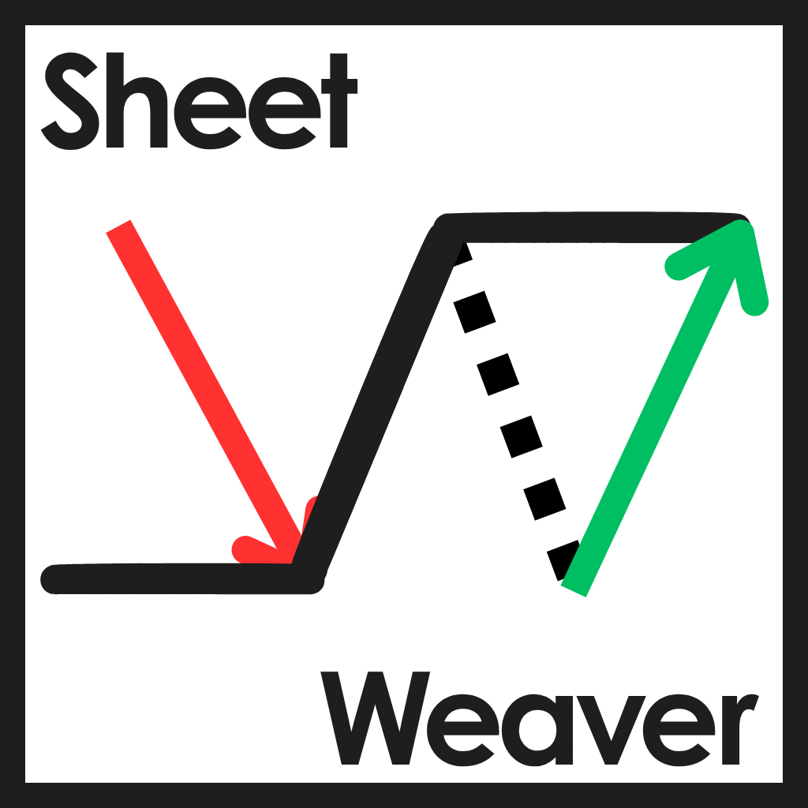

<div align="center">

</div>

<p align="center">
Turning scattered broker data into clean, organized, and live-updating spreadsheets.
</p>

<div align="center">

[](./LICENSE)
[](#)
[](https://v2.tauri.app/)
[](https://groww.in/)


</div>

## SheetWeaver
SheetWeaver converts bloated, static portfolio exports from brokers into clean, live-updating, and organized spreadsheets.

<table align="center">
    <tr>
        <td align="center" width=50%>
            
            <i><b>SheetWeaver</b> preview</i>
        </td>
    </tr>
    <tr>
        <td align="center">
            
            <i>Generated <b>Output</b></i>
        </td>
    </tr>
</table>

## ✨ Features
- **📈 Live Updates:** Injects `GOOGLEFINANCE` formulas so your portfolio always reflects real-time market data.
- **🔒 Privacy-Focused:** No databases. No cloud storage. Everything runs locally on your machine.
- **⚡ Lightweight & Fast:** Built on Tauri, utilizing system native webviews for a minimal footprint.
- **🆓 Free & Open Source:** Free forever. No subscriptions, and community-driven.

## 📌 Current Support
At the moment, SheetWeaver is primarily designed around Groww portfolio exports.Support for additional brokers and asset classes is planned.


## 🚀 How to Use
<details>
<summary>Click to view 3-steps guideline</summary>

### 1. Login to your Groww portal and download the report

Groww portal: https://groww.in/

<table align="center">
    <tr>
        <td align="center" >
            
            <i>Click the profile picture(at top right) and then click on <b>Reports</b></i>
        </td>
    </tr>
    <tr>
        <td align="center" >
            
            <i>Select the Stocks-Holding and then click <b>Download</b></i>
        </td>
    </tr>
</table>


### 2. Open SheetWeaver then upload the downloaded report

### 3. To view upload the generated excel file in drive and open it with googlesheets

>💡 **NOTE:** Live market data depends on `GOOGLEFINANCE` and Google's availability, supported symbols, market coverage, and update behavior.

</details>

## ⬇️ Download
Download the latest Windows release from the project's **[GitHub Releases](https://github.com/Adamya-Gupta/SheetWeaver/releases)** page and run the installer.

## ⚠️ **Warning & Disclaimer**

>[!IMPORTANT]
>
>SheetWeaver is provided as an open-source utility for organizing and transforming portfolio data. It is not financial, investment, tax, accounting, or legal advice.
>
>While reasonable care is taken when developing and testing the application, SheetWeaver may contain bugs, incorrect calculations, unsupported securities, parsing errors, or compatibility issues caused by changes to broker reports, spreadsheet software, external services, or market-data providers.
>
>Always verify generated values against your broker's original records before using them for financial, tax, investment, or other consequential decisions.
>
>The maintainers of SheetWeaver are not responsible for financial losses, data loss, incorrect calculations, missed transactions, incorrect portfolio values, or any other direct or indirect consequences resulting from the use of this software, to the extent permitted by applicable law.

## 🛑 Limitations
- Broker report formats may change without notice.
- Not every security may be supported by `GOOGLEFINANCE`.
- Market data may be delayed, unavailable, or incomplete.
- Generated formulas may behave differently depending on the spreadsheet application being used.

## ❓ FAQ

**Q: Why should I use this when I can directly download the excel file from the platform ?**

**A:** Two main reasons!
First, you only need to use this tool once. After that, your Excel file will automatically sync with live market data without any extra effort on your end. <br>
Second, the default files provided by brokers are typically bloated, colorless, disorganized, and completely static.

<div align="center">
See the difference for yourself
<table align="center">
  <tr>
    <td align="center" width="500px">
      
      <br>
      <i>Static, raw export</i>
    </td>
    <td align="center" width="500px">
      
      <br>
      <i>Well-formatted, color-coded, and live-updated</i>
    </td>
  </tr>
</table>
</div>

**Q: Where is the user data stored, and what about privacy?**

**A:** No database is used as no data is stored to make things fast and you can download the desktop app which is fully offline so your data stays on your device only.

## 🧠 Technical Decisions & Rationale

**1. Why use the `Buy Price` as a fallback value for `Live Price` instead of the `Closing Price` provided in the broker report?**

**The Google Sheets Caching Quirk:** If you are importing this .xlsx file into Google Sheets, Google often evaluates bulk finance functions as #N/A for a brief second while the data fetches. If your fallback is a hardcoded string literal (e.g., injecting 135.52 directly into the formula), Sheets sometimes caches the fallback evaluation and stops trying to poll the live API.


```typescript
livePriceCell.value = { 
    formula: `IFERROR(GOOGLEFINANCE("${ticker}", "price"), C${rowIndex})` 
} as ExcelJS.CellValue;
```

For example, if we used a hardcoded value instead of a cell reference, Sheets would just return the hardcoded value and skip fetching the live stock price:

```bash
=IFERROR(GOOGLEFINANCE("GOOG:NASDAQ", "price"), C3) # ✔️ Will fetch the price first
=IFERROR(GOOGLEFINANCE("GOOG:NASDAQ", "price"), 0) # ❌ Skips calling api and returns 0
```

**2. Why GOOGLEFINANCE?**

It is the easiest way to get live market data directly into a spreadsheet. This delegates the heavy lifting to Google, allowing the spreadsheet itself to request supported market data rather than requiring SheetWeaver to maintain its own costly price database or market-data infrastructure.

**3. Why Tauri over Electron ?** 

Ans: The project currently favors Tauri because of its smaller runtime footprint and its suitability for a lightweight desktop application.

|Parameter|||
|---------|--------|-----|
|SheetWeaver size after installation| ~700 MB | ~11 MB|
|Performance| Resource-heavy | Native & Fast |

>[!NOTE]
>The size figures above are project-specific observations and can change across versions and build configurations. They should not be treated as universal Electron-vs-Tauri benchmarks.

## 🗺️ Roadmap
- [ ] Add Mutual funds support
- [ ] Integrate additional broker platforms
- [ ] Allow users to enter tickers directly 
- [ ] Add a Developer mode with API-key support
- [ ] Automatically fetch/update ISIN codes
- [ ] Generate and email monthly portfolio reports
- [ ] Add Linux Support

## 🛠️ Development

### TECHSTACK

<div align="center">

[](https://nextjs.org/)
[](https://tailwindcss.com/)
[](https://www.typescriptlang.org/)
[](https://nodejs.org/en)
[](https://v2.tauri.app/)
[](https://github.com/exceljs/exceljs)
</div>

Run the development server:

```bash
npm install
npm run dev
```

Open [http://localhost:3000](http://localhost:3000) with your browser to see the result.

Run the Tauri app:

```bash
npx tauri dev
```

Build the application yourself:

```bash
npx tauri build
```

## 🤝 Contributing
Contributions, bug reports, feature suggestions, and improvements are welcome.

Before submitting a pull request, please consider opening an issue for larger changes so the proposed approach can be discussed first.

## ⭐️ Show Your Support
If you found SheetWeaver helpful in organizing your investments, please consider giving the repository a star! It helps the project grow and makes it more visible to others who might benefit from it.

---
